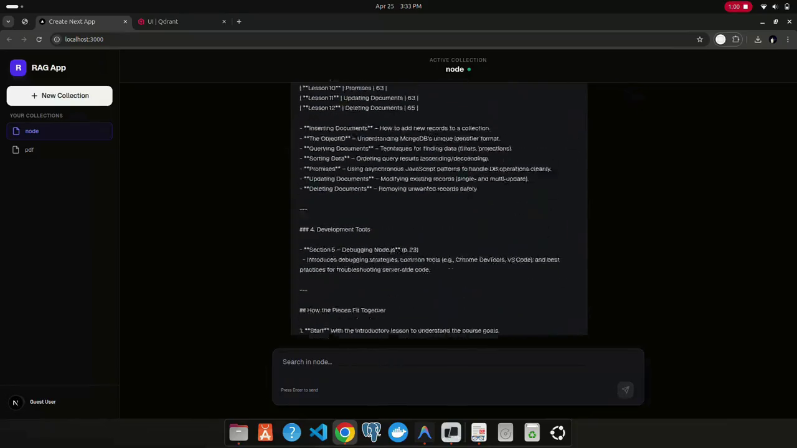
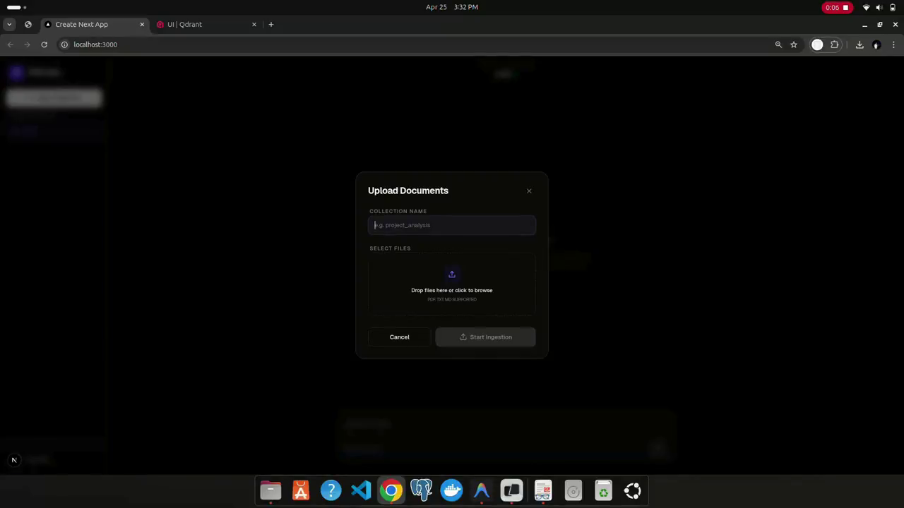

# 🧠 Multi-Model RAG Chatbot

A high-performance, full-stack **Retrieval-Augmented Generation (RAG)** chatbot that allows you to upload document collections (PDF, TXT, MD) and chat with them using modern LLM providers. Features semantic search citation tracking and full dark/light theme options with a premium glassmorphic interface.

## 📸 Preview

### Conversational Q&A & Citation References


### Document Ingestion & Vector Storage


### 🎥 Demo Walkthrough
<video src="public/rag_chatbot.mp4" width="100%" controls></video>

## 🔗 Live Demo
**[Try it live →](https://rag-chatbot-showcase.vercel.app)**

## ✨ Features
- **📂 Document Collections** — Create custom document scopes (e.g. `finance_q4`, `hr_policies`) and easily switch between them.
- **📚 Multi-Format Ingestion** — Drop PDFs, TXT files, and Markdown documents to instantly parse and store their embeddings.
- **🤖 Multi-Model Support** — Query your documents using **Google Gemini**, **Groq**, or **Ollama** (local models).
- **🗄️ Multi-Vector DB Options** — Compatible with **Pinecone** (cloud) and **Qdrant** (local/cloud) vector search engines.
- **📍 Cited Sources** — Each answer highlights exact files and section numbers referenced by the model, eliminating AI hallucinations.

## 🛠️ Tech Stack
- **Framework:** Next.js (App Router) + TypeScript
- **RAG & Agent Orchestration:** **LangChain** (Core, Community, Text Splitters)
- **Vector DB Clients:** `@qdrant/js-client-rest`, `@pinecone-database/pinecone`
- **Supported Models:** `@langchain/google-genai` (Gemini), `@langchain/groq`, `@langchain/ollama`
- **Document Parser:** `pdf-parse`
- **Styling:** Tailwind CSS v4

## 🚀 Run Locally

### 1. Clone & Install
```bash
git clone https://github.com/sourov808/rag_chatbot.git
cd rag_chatbot
pnpm install
```

### 2. Configure Environment Variables
Create a `.env.local` file in the root directory:
```env
GOOGLE_API_KEY=your_gemini_api_key
GROQ_API_KEY=your_groq_api_key

# Qdrant Database Settings
QDRANT_URL=your_qdrant_url
QDRANT_API_KEY=your_qdrant_api_key
```

### 3. Run Development Server
```bash
pnpm dev
```
Open [http://localhost:3000](http://localhost:3000) with your browser to see the result.
